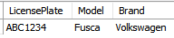
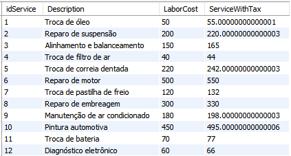
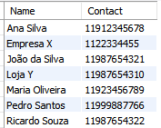
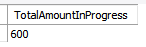
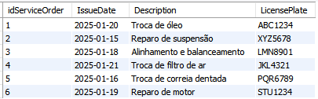
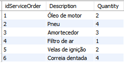
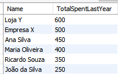
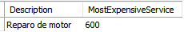

# Desafio de Banco de Dados para Oficina Mecânica

Este repositório contém a modelagem lógica de um banco de dados para o contexto de uma oficina, o script SQL para criação do esquema do banco, a inserção de dados e a execução de queries complexas para análise.

O modelo relacional utilizado neste projeto está localizado na pasta "Sistemas_Relacionais_em_Banco_de_Dados", no arquivo chamado "Projeto_Conceitual_Oficina_Mecanica"

---

## Descrição do Desafio

O objetivo deste desafio foi criar o esquema lógico do banco de dados para uma oficina, considerando chaves primárias, chaves estrangeiras e constraints, além de implementar o banco de dados e desenvolver queries SQL com diferentes níveis de complexidade.

As diretrizes para as queries incluem:
- Recuperações simples com SELECT Statement;
- Filtros com WHERE Statement;
- Criação de expressões para atributos derivados;
- Ordenação de dados com ORDER BY;
- Filtros por grupos utilizando HAVING Statement;
- Junções entre tabelas para análises mais complexas.

--- 

## Estrutura do Projeto

O projeto está organizado nos seguintes arquivos:
-  [Códigos SQL para criar tabelas](Criando_BD_e_Tabelas.sql)**`Criando_BD_e_Tabelas`**: Script para criação do esquema do banco de dados.
- [Códigos SQL para popular as tabelas](Populando_Tabelas.sql) **`Populando_Tabelas.sql`**: Script para inserção de dados nas tabelas.
- [Códigos SQL para queries](Queries.sql)**`Queries.sql`**: Conjunto de queries para análise dos dados.
-  [Imagens dos resultados das queries](resultados) **`resultados/`**: Pasta contendo as imagens dos resultados das queries.

--- 

## Queries Desenvolvidas

**Códigos SQL das queries desenvolvidas [Códigos SQL para queries](Mudar o nome):**

As queries foram projetadas para responder a perguntas relevantes no contexto da oficina, explorando diferentes aspectos dos dados.

As queries utilizam combinações de SELECT, JOIN, WHERE, GROUP BY, HAVING e funções agregadas como SUM e COUNT.

## Query 1: Recuperar veículos de um determinado cliente

**Descrição:**
Retorna os veículos associados a um cliente específico, filtrando pelo nome do cliente.

## Query 2: Calcular o valor total de cada serviço com imposto aplicado
**Descrição:**
Exibe as informações do serviço e calcula o valor com um acréscimo de 10% de imposto, utilizando uma expressão derivada.
 
 

## Query 3: Ordenar clientes por nome em ordem alfabética
**Descrição:**
Organiza a lista de clientes em ordem crescente pelo nome, exibindo nome e contato.

## Query 4: Ordenar veículos por ano de fabricação
**Descrição:**
Lista os veículos organizados do mais novo para o mais antigo, exibindo placa, modelo, marca e ano.

## Query 5: Somar o valor total dos serviços em andamento
**Descrição:**
Calcula a soma de todos os serviços que ainda estão em andamento, exibindo o valor total.

## Query 6: Detalhar ordens de serviço com informações do veículo e serviço
**Descrição:**
Recupera os detalhes das ordens de serviço, incluindo o nome do veículo e a descrição do serviço.

## Query 7: Listar peças utilizadas em cada ordem de serviço
**Descrição:**
Mostra os detalhes das peças usadas em cada ordem de serviço, incluindo o código da peça e a quantidade utilizada.

## Query 8:  Valor total gasto por cada cliente no último ano
**Descrição:**
Calcula o valor total que cada cliente gastou em serviços nos últimos 12 meses, exibindo os resultados em ordem decrescente de gasto.

## Query 9: Serviço mais caro já realizado
**Descrição:**
Identifica o serviço mais caro realizado, exibindo a descrição do serviço e o valor máximo.

## Query 10: Serviços que nunca foram utilizados
**Descrição:**
Lista os serviços que ainda não foram vinculados a nenhuma ordem de serviço.

---

## Como Executar

1. Execute o script **`Criando_BD_e_Tabelas.sql`** para criar o esquema do banco de dados.
2. Execute o script **`Populando_Tabelas.sql`** para inserir dados nas tabelas.
3. Execute as queries no arquivo **`Queries.sql`** para explorar os dados e responder às perguntas.

---

## **Conclusão:**

Este projeto demonstra a aplicação prática de um modelo de banco de dados para a gestão de serviços automotivos, desde a estruturação das tabelas até a elaboração de queries para análise de dados. As consultas desenvolvidas utilizam cláusulas como SELECT, JOIN, WHERE, GROUP BY e funções agregadas como SUM, MAX e COUNT, atendendo a cenários comuns de análise e tomada de decisão no setor.

---

## **Certificação:**

---

## **FIM**
