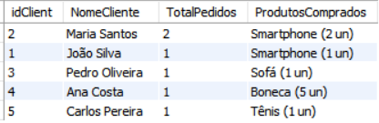
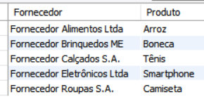
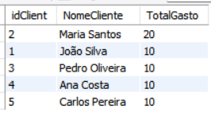
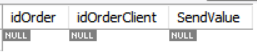
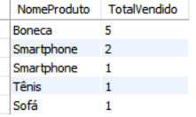
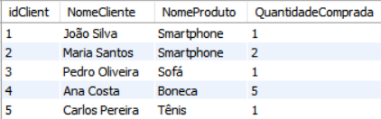
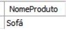
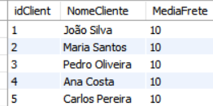

# Desafio de Banco de Dados para E-commerce

Este repositório contém a modelagem lógica de um banco de dados para um cenário de e-commerce, bem como o script SQL para criação do esquema do banco de dados(Criando_banco.sql), persistência de dados (populando_banco.sql) e queries complexas (Queries_Desafio.sql) para análise dos dados.

**O modelo relacional utilizado neste projeto está localizado na pasta Sistema_Relacionais_em_Banco_de_Dados, no arquivo "Projeto_Conceitual_Banco_de_Dados_E-Commerce"**

---

## Descrição do Desafio

O objetivo deste desafio é replicar a modelagem do projeto lógico de banco de dados para o cenário de e-commerce, considerando chaves primárias, chaves estrangeiras e constraints. Além disso, foram aplicados refinamentos propostos no módulo de modelagem conceitual, e foram criadas queries SQL complexas para atender às diretrizes abaixo:

1. **Recuperações simples com SELECT Statement**
2. **Filtros com WHERE Statement**
3. **Crie expressões para gerar atributos derivados**
4. **Defina ordenações dos dados com ORDER BY**
5. **Condições de filtros aos grupos – HAVING Statement**
6. **Crie junções entre tabelas para fornecer uma perspectiva mais complexa dos dados**

---

## Estrutura do Projeto

O projeto está organizado nos seguintes arquivos:
- [Códigos SQL para criar tabelas](Criando_banco.sql): **`Criando_banco.sql`**: Script para criação do esquema do banco de dados (tabelas, chaves primárias, chaves estrangeiras e constraints).
-  [Códigos SQL para popular as tabelas](populando_banco.sql) **`populando_banco.sql`**: Script para inserção de dados nas tabelas.
- [Códigos SQL para queries](Queries_Desafio.sql) **`Queries_Desafio.sql`**: Queries complexas para análise dos dados.
- [Imagens dos resultados das queries](resultados) **`resultados/`**: Pasta contendo as imagens dos resultados das queries.

---

## Queries Desenvolvidas

**Códigos SQL das queries desenvolvidas [Códigos SQL para queries](Queries_Desafio.sql):**

Abaixo estão as queries desenvolvidas.

## Query 1: Quantos pedidos foram feitos por cada cliente?
**Descrição:** Esta query retorna a quantidade de pedidos feitos por cada cliente, juntamente com os produtos comprados e suas quantidades, ordenados pelo número total de pedidos de forma decrescente.

---

## Query 2: Algum vendedor também é fornecedor?
**Descrição:**
 Esta query verifica se algum vendedor também é fornecedor, comparando o CNPJ das tabelas de vendedores e fornecedores.

---

## Query 3: Relação de produtos, fornecedores e estoques
**Descrição:**
 Esta query retorna a relação de produtos, seus fornecedores, as quantidades fornecidas e as quantidades em estoque.

---

## Query 4: Relação de nomes dos fornecedores e nomes dos produtos
**Descrição:**
Esta query retorna a relação de fornecedores e os produtos que eles fornecem, ordenados por fornecedor e produto.

---

## Query 5: Valor total gasto por cada cliente (atributo derivado)
**Descrição:**
Esta query calcula o valor total gasto por cada cliente, ordenado de forma decrescente.

---

## Query 6: Pedidos com valor de frete superior a 15 (filtro com WHERE)
**Descrição:**
Esta query retorna os pedidos com valor de frete superior a 15.

---

## Query 7: Produtos mais vendidos (ordenados por quantidade)
**Descrição:**
Esta query retorna os produtos mais vendidos, ordenados pela quantidade total vendida de forma decrescente.

---

## Query 8: Clientes que fizeram mais de 2 pedidos (filtro com HAVING)
**Descrição:**
Esta query retorna os clientes que fizeram mais de 2 pedidos, listando os produtos comprados e suas quantidades.

---

## Query 9: Relação de produtos e seus estoques (junção de tabelas)
**Descrição:**
Esta query retorna a relação de produtos e seus estoques, incluindo o local de armazenamento e a quantidade disponível.

---

## Query 10: Fornecedores que fornecem mais de 100 unidades de um produto (filtro com HAVING)
**Descrição:**
Esta query retorna os fornecedores que fornecem mais de 100 unidades de um produto.

---

## Query 11: Pedidos com status "Cancelado" (filtro com WHERE)
**Descrição:**
Esta query retorna os pedidos com status "Cancelado".

---

## Query 12:  Produtos sem estoque (filtro com WHERE)
**Descrição:**
Esta query retorna os produtos sem estoque.

---

## Query 13: Média de valor de frete por cliente (atributo derivado)
**Descrição:**
Esta query calcula a média de valor de frete por cliente, ordenada de forma decrescente.

---

## **Conclusão:**

Este projeto demonstra a aplicação prática de um modelo lógico de banco de dados para um cenário de e-commerce, desde a criação das tabelas até a execução de queries complexas para análise dos dados. As queries desenvolvidas atendem às diretrizes do desafio, utilizando cláusulas como SELECT, JOIN, WHERE, GROUP BY, HAVING e funções agregadas como SUM, AVG e COUNT.

---

## **Como Executar:**

**1-** Execute o script Criando_banco.sql para criar o esquema do banco de dados.

**2-** Execute o script populando_banco.sql para inserir os dados nas tabelas.

**3-** Execute as queries do arquivo Queries_Desafio.sql para analisar os dados.

---

## **Certificação:**

## **FIM**
