# Desafio de Banco de Dados para E-commerce

Este repositório contém a modelagem lógica de um banco de dados para um cenário de e-commerce, bem como o script SQL para criação do esquema do banco de dados(Criando_banco.sql), persistência de dados (populando_banco.sql) e queries complexas (Queries_Desafio.sql) para análise dos dados.

---

## Descrição do Desafio

O objetivo deste desafio é replicar a modelagem do projeto lógico de banco de dados para o cenário de e-commerce, considerando chaves primárias, chaves estrangeiras e constraints. Além disso, foram aplicados refinamentos propostos no módulo de modelagem conceitual, e foram criadas queries SQL complexas para atender às diretrizes abaixo:

1. **Recuperações simples com SELECT Statement**
2. **Filtros com WHERE Statement**
3. **Crie expressões para gerar atributos derivados**
4. **Defina ordenações dos dados com ORDER BY**
5. **Condições de filtros aos grupos – HAVING Statement**
6. **Crie junções entre tabelas para fornecer uma perspectiva mais complexa dos dados**

---

## Estrutura do Projeto

O projeto está organizado nos seguintes arquivos:
- **`Criando_banco.sql`**: Script para criação do esquema do banco de dados (tabelas, chaves primárias, chaves estrangeiras e constraints).
- **`populando_banco.sql`**: Script para inserção de dados nas tabelas.
- **`Queries_Desafio.sql`**: Queries complexas para análise dos dados.
- **`resultados/`**: Pasta contendo as imagens dos resultados das queries.

---

## Criação do Banco de Dados (`Criando_banco.sql`):
```sql
create database ecommerce;
```
---

### Tabela `client`
```sql
CREATE TABLE client (
    idClient INT AUTO_INCREMENT PRIMARY KEY,
    Fname VARCHAR(10),
    Minit CHAR(3),
    Lname VARCHAR(20),
    CPF CHAR(11) NOT NULL,
    Address VARCHAR(30),
    CONSTRAINT unique_cpf_client UNIQUE (CPF)
);

```


### Tabela `product`

> **Observação:** size = dimensão do produto
```sql

create table product(
	idProduct int auto_increment primary key,
	Pname varchar(50) not null,
    Classification_kids bool default false,
    Category enum('Eletrônico', 'Roupas', 'Brinquedos', 'Alimentos', 'Calçados', 'Petshop', 'Móveis') not null, 
	Reviews float default 0,
    Size varchar(10)
);
```
---

### Tabela `orders`
```sql

create table orders (
	idOrder int auto_increment primary key,
    idOrderClient int,
    OrderStatus enum('Cancelado', 'Confirmado', 'Em processamento') default 'Em processamento',
    OrderDescription varchar(255),
    SendValue float default 10,
    PaymentCash bool default false,
    constraint fk_order_client foreign key (idOrderClient) references client(idClient)
);
```
---

### Tabela `payments`
```sql
create table payments (
    idPayment INT AUTO_INCREMENT PRIMARY KEY,            
    idOrder INT NOT NULL,                               
    PaymentMethod ENUM('Cartão Débito', 'Cartão Crédito', 'Dinheiro', 'Pix') NOT NULL, 
    PaymentDate DATE NOT NULL,                           
    PaymentStatus ENUM('Pendente', 'Pago', 'Cancelado') NOT NULL, 
    foreign key (idOrder) references orders(idOrder)     
);
```

---


### Tabela `productStorage`
```sql

create table  productStorage(
	idProdStorage int auto_increment primary key,
    StorageLocation varchar(255),
    Quantity int default 0
);
```
---

### Tabela `supplier`
```sql

create table supplier(
    idSupplier int auto_increment primary key,
    SocialName varchar(255) not null,
    CNPJ char(15) not null,
	Contact char(11) not null,
	constraint unique_supplier unique(CNPJ)
);
```
---

### Tabela `seller`
```sql

create table seller(
    idSeller int auto_increment primary key,  
    SocialName varchar(255) not null,
    AbstName varchar(255),
    CNPJ char(15),
    CPF char(11),
    Location varchar(255),
    Contact char(11) not null,
    constraint unique_cnpj_seller unique (CNPJ),
    constraint unique_cpf_seller unique (CPF)
    
);
```
---

### Tabela `productSeller`
```sql

create table productSeller(
	idPseller int,
    idProduct int,
    ProdQuantity int default 1,
    primary key (idPseller, idProduct),
    constraint fk_product_seller foreign key (idPseller) references seller(idSeller),
    constraint	fk_product_product foreign key (idProduct) references product(idProduct)
);
```
---

### Tabela `productOrder`
```sql

create table productOrder(
	idPOproduct int,
    idPOorder int,
    poQuantity int default 1,
    poStatus enum('Disponível', 'Sem Estoque') default 'Disponível',
    primary key (idPOproduct, idPOorder),  
    constraint  fk_productorder_seller foreign key (idPOproduct) REFERENCES product(idProduct), 
    constraint fk_productorder_order foreign key (idPOorder) REFERENCES orders(idOrder)
);
```
---

### Tabela `storageLocation`
```sql

create table storageLocation(
	idLproduct int,
    idLstorage int,
    location varchar(255) not null,
    primary key (idLproduct, idLstorage),
    constraint fk_storage_location_product foreign key (idLproduct) references product(idProduct),
    constraint fk_storage_location_storage foreign key (idLstorage) references productStorage(idProdStorage)
);
```
---

### Tabela `productSupplier`
```sql
create table productSupplier(
	idPsSupplier int,
    idPsProduct int,
    quantity int not null,
    primary key (idPsSupplier, idPsProduct),
    constraint fk_product_supplier_supplier foreign key (idPsSupplier) references supplier(idSupplier),
    constraint fk_product_supplier_product foreign key (idPsProduct) references product(idProduct)
);
```


## Queries Desenvolvidas

Abaixo estão as queries desenvolvidas.

## Query 1: Quantos pedidos foram feitos por cada cliente?
**Descrição:** Esta query retorna a quantidade de pedidos feitos por cada cliente, juntamente com os produtos comprados e suas quantidades, ordenados pelo número total de pedidos de forma decrescente.

**Código SQL:**

```sql
SELECT 
    c.idClient, 
    CONCAT(c.Fname, ' ', c.Lname) AS NomeCliente, 
    COUNT(DISTINCT o.idOrder) AS TotalPedidos,
    GROUP_CONCAT(
        CONCAT(p.Pname, ' (', po.poQuantity, ' un)') 
        SEPARATOR ', '
    ) AS ProdutosComprados
-- Tabela base: clientes
FROM client c
-- Junção com a tabela de pedidos
LEFT JOIN orders o ON c.idClient = o.idOrderClient
-- Junção com a tabela de produtos por pedido
LEFT JOIN productOrder po ON o.idOrder = po.idPOorder
-- Junção com a tabela de produtos
LEFT JOIN product p ON po.idPOproduct = p.idProduct
-- Agrupa os resultados por cliente
GROUP BY c.idClient
-- Ordena pelo total de pedidos (decrescente)
ORDER BY TotalPedidos DESC;
```

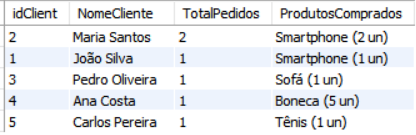

---

## Query 2: Algum vendedor também é fornecedor?
**Descrição:**
 Esta query verifica se algum vendedor também é fornecedor, comparando o CNPJ das tabelas de vendedores e fornecedores.

**Código SQL:**
```sql
SELECT 
    s.idSeller, 
    s.SocialName AS NomeVendedor, 
    s.CNPJ AS CNPJ_Vendedor, 
    su.idSupplier, 
    su.SocialName AS NomeFornecedor, 
    su.CNPJ AS CNPJ_Fornecedor
FROM seller s
JOIN supplier su ON s.CNPJ = su.CNPJ;
```
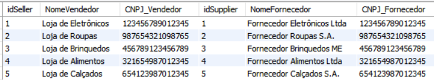

---

## Query 3: Relação de produtos, fornecedores e estoques
**Descrição:**
 Esta query retorna a relação de produtos, seus fornecedores, as quantidades fornecidas e as quantidades em estoque.


**Código SQL:**
```sql

SELECT 
    p.Pname AS NomeProduto, 
    s.SocialName AS Fornecedor, 
    ps.quantity AS QuantidadeFornecida, 
    sl.location AS LocalEstoque, 
    ps2.Quantity AS QuantidadeEmEstoque
FROM product p
JOIN productSupplier ps ON p.idProduct = ps.idPsProduct
JOIN supplier s ON ps.idPsSupplier = s.idSupplier
JOIN storageLocation sl ON p.idProduct = sl.idLproduct
JOIN productStorage ps2 ON sl.idLstorage = ps2.idProdStorage;
```
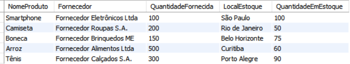

---

## Query 4: Relação de nomes dos fornecedores e nomes dos produtos
**Descrição:**
Esta query retorna a relação de fornecedores e os produtos que eles fornecem, ordenados por fornecedor e produto.


**Código SQL:**
```sql
SELECT 
    s.SocialName AS Fornecedor, 
    p.Pname AS Produto
FROM supplier s
JOIN productSupplier ps ON s.idSupplier = ps.idPsSupplier
JOIN product p ON ps.idPsProduct = p.idProduct
ORDER BY Fornecedor, Produto;
```
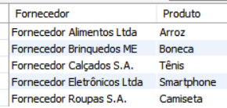

---

## Query 5: Valor total gasto por cada cliente (atributo derivado)
**Descrição:**
Esta query calcula o valor total gasto por cada cliente, ordenado de forma decrescente.


**Código SQL:**
```sql
SELECT 
    c.idClient, 
    CONCAT(c.Fname, ' ', c.Lname) AS NomeCliente, 
    SUM(o.SendValue) AS TotalGasto
FROM client c
LEFT JOIN orders o ON c.idClient = o.idOrderClient
GROUP BY c.idClient
ORDER BY TotalGasto DESC;
```


---

## Query 6: Pedidos com valor de frete superior a 15 (filtro com WHERE)
**Descrição:**
Esta query retorna os pedidos com valor de frete superior a 15.


**Código SQL:**
```sql
SELECT 
    idOrder, 
    idOrderClient, 
    SendValue
FROM orders
WHERE SendValue > 15;
```
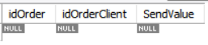

---

## Query 7: Produtos mais vendidos (ordenados por quantidade)
**Descrição:**
Esta query retorna os produtos mais vendidos, ordenados pela quantidade total vendida de forma decrescente.


**Código SQL:**
```sql
SELECT 
    p.Pname AS NomeProduto, 
    SUM(po.poQuantity) AS TotalVendido
FROM product p
JOIN productOrder po ON p.idProduct = po.idPOproduct
GROUP BY p.idProduct
ORDER BY TotalVendido DESC;
```
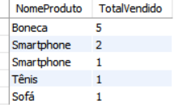

---

## Query 8: Clientes que fizeram mais de 2 pedidos (filtro com HAVING)
**Descrição:**
Esta query retorna os clientes que fizeram mais de 2 pedidos, listando os produtos comprados e suas quantidades.


**Código SQL:**
```sql
SELECT 
    c.idClient, 
    CONCAT(c.Fname, ' ', c.Lname) AS NomeCliente, 
    p.Pname AS NomeProduto, 
    SUM(po.poQuantity) AS QuantidadeComprada
FROM client c
JOIN orders o ON c.idClient = o.idOrderClient
JOIN productOrder po ON o.idOrder = po.idPOorder
JOIN product p ON po.idPOproduct = p.idProduct
GROUP BY c.idClient, p.Pname
HAVING QuantidadeComprada > 0
ORDER BY c.idClient, QuantidadeComprada DESC;
```
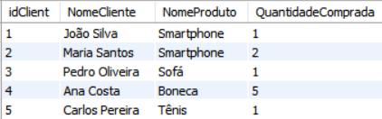


---

## Query 9: Relação de produtos e seus estoques (junção de tabelas)
**Descrição:**
Esta query retorna a relação de produtos e seus estoques, incluindo o local de armazenamento e a quantidade disponível.

**Código SQL:**
```sql
SELECT 
    p.Pname AS NomeProduto, 
    sl.location AS LocalEstoque, 
    ps.Quantity AS QuantidadeEmEstoque
FROM product p
JOIN storageLocation sl ON p.idProduct = sl.idLproduct
JOIN productStorage ps ON sl.idLstorage = ps.idProdStorage;
```
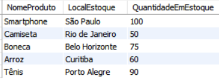


---

## Query 10: Fornecedores que fornecem mais de 100 unidades de um produto (filtro com HAVING)
**Descrição:**
Esta query retorna os fornecedores que fornecem mais de 100 unidades de um produto.


**Código SQL:**
```sql
SELECT 
    s.SocialName AS Fornecedor, 
    p.Pname AS Produto, 
    ps.quantity AS QuantidadeFornecida
FROM supplier s
JOIN productSupplier ps ON s.idSupplier = ps.idPsSupplier
JOIN product p ON ps.idPsProduct = p.idProduct
GROUP BY s.idSupplier, p.idProduct
HAVING ps.quantity > 100;
```
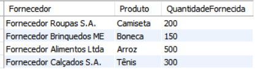


---

## Query 11: Pedidos com status "Cancelado" (filtro com WHERE)
**Descrição:**
Esta query retorna os pedidos com status "Cancelado".


**Código SQL:**
```sql
SELECT 
    idOrder, 
    idOrderClient, 
    OrderStatus
FROM orders
WHERE OrderStatus = 'Cancelado';
```
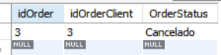


---

## Query 12:  Produtos sem estoque (filtro com WHERE)
**Descrição:**
Esta query retorna os produtos sem estoque.

**Código SQL:**
```sql
SELECT 
    p.Pname AS NomeProduto
FROM product p
JOIN productOrder po ON p.idProduct = po.idPOproduct
WHERE po.poStatus = 'Sem Estoque';
```
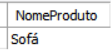

---

## Query 13: Média de valor de frete por cliente (atributo derivado)
**Descrição:**
Esta query calcula a média de valor de frete por cliente, ordenada de forma decrescente.


**Código SQL:**
```sql
SELECT 
    c.idClient, 
    CONCAT(c.Fname, ' ', c.Lname) AS NomeCliente, 
    AVG(o.SendValue) AS MediaFrete
FROM client c
LEFT JOIN orders o ON c.idClient = o.idOrderClient
GROUP BY c.idClient
ORDER BY MediaFrete DESC;
```
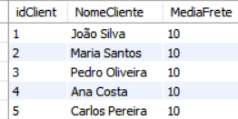

---

## **Conclusão:**

Este projeto demonstra a aplicação prática de um modelo lógico de banco de dados para um cenário de e-commerce, desde a criação das tabelas até a execução de queries complexas para análise dos dados. As queries desenvolvidas atendem às diretrizes do desafio, utilizando cláusulas como SELECT, JOIN, WHERE, GROUP BY, HAVING e funções agregadas como SUM, AVG e COUNT.

---

## **Como Executar:**

**1-** Execute o script Criando_banco.sql para criar o esquema do banco de dados.

**2-** Execute o script populando_banco.sql para inserir os dados nas tabelas.

**3-** Execute as queries do arquivo Queries_Desafio.sql para analisar os dados.

---

## **Certificação:**


## **FIM**
